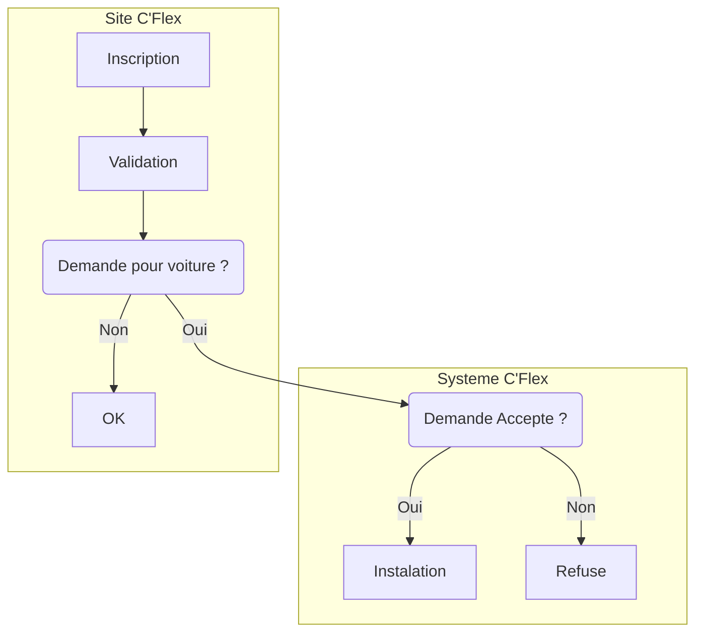

# API C'Flex
Déplacement avec Flexibilité

 <br>
Projet de dévéloppement des API pour les fonctionalitées du projet C'Flex

## API de gestion des demandes d'enrégistrement

Ce API sert principalement à gérer principalement les demandes d'enregistrement des véhicules dans le systemes
## Procédure


## EndPoint API demande

| Méthode | Point de terminaison |                                         Résulat |
|:--------|:--------------------:|------------------------------------------------:|
| GET     |    /api/demandes     |                 la liste de toutes les demandes |
| GET     |  /api/demandes/{id}  |         la demande dont l'id est passé en param |
| POST    |    /api/demandes     |                 enregistre une nouvelle demande |
| PUT     |  /api/demandes/{id}  |  Editer la demande dont l'id est passé en param |
| DELETE  |  /api/demandes/{id}  | Suprime la demande dont l'id est passé en param |
## Code à Ajouter au projet Officiel
###### Controller/DemandeController.java
```java

@RestController
@RequestMapping("/api")

@Tag(name = "L'API de Demande", description = "L'Api de la gestion des demande")
/**
 * Api demande
 * @author Yao Eloge
 */
public class DemandeController {
    DemandeService demandeService;

    /**
     * DemandeController
     * @param demandeService
     */
    @Autowired
    public DemandeController(DemandeService demandeService) {
        this.demandeService = demandeService;
    }
    /** Optenir la liste des demandes
     * @return la liste des demandes
     */
    @GetMapping(value = "/demandes")
    public List<Demande> getAllDemandes() {
        return demandeService.getAllDemandes();
    }

    /** Obtenir une une demande avec l'id passe en param
     * @param id
     * @return la liste des demandes
     */
    @GetMapping(value = "/demandes/{id}")
    public Demande getDemandeById(@PathVariable("id") @Min(1) int id) {
        Demande demande = demandeService.findById(id).
                orElseThrow(() -> new DemandeNotFoundException("Demande introuvable avec l'identifiant: " + id));
        return demande;
    }

    /** Ajouter une nouvelle demande
     * @param input
     * @return message
     */
    @PostMapping(value = "/demandes")
    public String createDemande(@Valid @RequestBody @NotNull DemandeObject input) {
        Demande demande = new Demande();
        saveDemande(input, demande);
        return "Demande cree avec succes";
    }

    /**
     *  Procedure pour gerer l'enregistrement d'une demande
     * @param input
     * @param demande
     */
    private void saveDemande(@RequestBody @Valid @NotNull DemandeObject input, Demande demande) {
        demande.setCodeDemande(input.getCodeDemande());
        demande.setEtat(input.getEtat());
        demande.setIdProprietaireFk(input.getProprietaireId());
        demande.setDate(input.getDate());
        demande.setStatut(input.getStatus());
        demande.setIdTypeTransportFk(input.getTypeTransportId());
        demande.setIdZoneFk(input.getZoneId());
        demandeService.save(demande);
    }


    /**
     * Editer une demande
     *
     * @param input
     * @return message
     */
    @PutMapping(value = "/demandes/{id}")
    public String updateDemande(@PathVariable("id") @Min(1) int id, @Valid @RequestBody DemandeObject input) {
        Demande demande = demandeService.findById(id).
                orElseThrow(() -> new DemandeNotFoundException("Demande introuvable avec l'identifiant: " + id));
        saveDemande(input, demande);
        return "Demande editer avec succes";
    }

    /**
     * Supprimer une demande
     *
     * @param id
     * @return message
     */
    @DeleteMapping(value = "/demandes/{id}")
    public String deleteDemande(@PathVariable("id") @Min(1) int id) {
        Demande demande = demandeService.findById(id).
                orElseThrow(() -> new DemandeNotFoundException("Demande introuvable avec l'identifiant: " + id));
        demandeService.deleteById(id);
        return "Demande avec l'ID :"+id+" supprimée succès";
    }
}

```


###### Controller/DemandeObject.java
```java

public class DemandeObject {
    private int id;
    private String codeDemande = CodeDemandeGenerator.generateRandomCodeDemande(10,48,122);
    private Boolean etat;
    private Instant date;
    private Boolean status = Boolean.FALSE;
    private int proprietaireId;

    private int typeTransportId;

    private int zoneId;


    public int getId() {
        return id;
    }

    public int getTypeTransportId() {
        return typeTransportId;
    }

    public void setTypeTransportId(int typeTransportId) {
        this.typeTransportId = typeTransportId;
    }

    public int getZoneId() {
        return zoneId;
    }

    public void setZoneId(int zoneId) {
        this.zoneId = zoneId;
    }

    public void setId(int id) {
        this.id = id;
    }

    public String getCodeDemande() {
        return codeDemande;
    }

    public void setCodeDemande(String codeDemande) {
        this.codeDemande = codeDemande;
    }

    public Boolean getEtat() {
        return etat;
    }

    public void setEtat(Boolean etat) {
        this.etat = etat;
    }

    public Instant getDate() {
        return date;
    }

    public void setDate(Instant date) {
        this.date = date;
    }

    public Boolean getStatus() {
        return status;
    }

    public void setStatus(Boolean status) {
        this.status = status;
    }

    public int getProprietaireId() {
        return proprietaireId;
    }

    public void setProprietaireId(int proprietaireId) {
        this.proprietaireId = proprietaireId;
    }
}
```
###### Controller/CodeDemandeGenerator.java
```java

public class CodeDemandeGenerator {
    public static String generateRandomCodeDemande(int len, int randNumOrigin, int randNumBound)
    {
        SecureRandom random = new SecureRandom();
        return random.ints(randNumOrigin, randNumBound + 1)
                .filter(i -> Character.isAlphabetic(i) || Character.isDigit(i))
                .limit(len)
                .collect(StringBuilder::new, StringBuilder::appendCodePoint,
                        StringBuilder::append)
                .toString();
    }
}

```
###### Model/Demande.java
```java
@AllArgsConstructor
@NoArgsConstructor
@Getter
@Setter
@ToString
@Entity
@Table(name = "demande", indexes = {
        @Index(name = "idx_demande_id_zone_fk", columnList = "id_zone_fk"),
        @Index(name = "idx_demande_id_type_transport_fk", columnList = "id_type_transport_fk"),
        @Index(name = "idx_demande_id_proprietaire_fk", columnList = "id_proprietaire_fk"),

})
@SQLDelete(sql = "UPDATE demande SET statut = true WHERE id=?")
@Where(clause = "statut=false")
public class Demande implements Serializable {
    @Id
    @GeneratedValue(strategy = GenerationType.IDENTITY)
    @Column(name = "id", nullable = false)
    private Integer id;

    @Column(name = "code_demande")
    private String codeDemande;

    @Column(name = "etat")
    private Boolean etat;

    @ManyToOne(targetEntity = Proprietaire.class, fetch = FetchType.EAGER, optional = false)
    @JoinColumn(name = "id_proprietaire_fk", insertable = false, updatable = false)
    //@JsonIdentityInfo(generator = ObjectIdGenerators.IntSequenceGenerator.class, property = "id")
    private Proprietaire proprietaire;


    @Column(name = "id_proprietaire_fk")
    private int idProprietaireFk;


    @Column(name = "date", nullable = false)
    private Instant date;

    @ManyToOne(targetEntity = TypeTransport.class, fetch = FetchType.EAGER, optional = false)
    @JoinColumn(name = "id_type_transport_fk", insertable = false, updatable = false)
    private TypeTransport TypeTransportFk;

    @Column(name = "id_type_transport_fk")
    private int idTypeTransportFk;


    @ManyToOne(targetEntity = Zone.class, fetch = FetchType.EAGER, optional = false)
    @JoinColumn(name = "id_zone_fk", insertable = false, updatable = false)
    private Zone ZoneFk;

    @Column(name = "id_zone_fk")
    private int idZoneFk;

    @Column(name = "statut", nullable = false)
    private Boolean statut = Boolean.FALSE;

}


```
###### Repository/DemandeRepository.java
```java
@Repository
public interface DemandeRepository extends JpaRepository<Demande, Integer> {

}

```
###### Service/IDemande.java
```java
public interface IDemande {
 
        List<Demande> getAllDemandes();
        Optional<Demande> findById(int id);

        Demande save(Demande std);
        void deleteById(int id);
}


```
###### Service/DemandeService.java
```java
@Service
public class DemandeService implements IDemande {
    DemandeRepository demanderepo;
    @Autowired
    public DemandeService(DemandeRepository demanderepo) {
        this.demanderepo = demanderepo;
    }
    @Override
    public List<Demande> getAllDemandes() {
        // TODO Auto-generated method stub
        return demanderepo.findAll();
    }

    @Override
    public Optional<Demande> findById(int id) {
        // TODO Auto-generated method stub
        return demanderepo.findById(id);
    }


    @Override
    public Demande save(Demande demande) {
        // TODO Auto-generated method stub
        return demanderepo.save(demande);
    }

    @Override
    public void deleteById(int id) {
        // TODO Auto-generated method stub
        demanderepo.deleteById(id);
    }
}
```
###### exception/DemandeNotFoundException.java 
```java
@Getter
@Setter
@ResponseStatus(value = HttpStatus.NOT_FOUND)
public class DemandeNotFoundException extends RuntimeException {
    private static final long serialVersionUID = 1L;
    private String message;
    public DemandeNotFoundException(String message) {
		super(message);
	}
}

```
### Model Json Accepter Pour POST ou PUT
```json
{
  "etat": true,
  "date": "2022-05-14T13:17:09.682Z",
  "proprietaireId": 1,
  "typeTransportId": 1,
  "zoneId": 1
}
```
### Valeurs Retounées

```json

[
  {
    "id": 5,
    "codeDemande": "Gbaka",
    "etat": true,
    "proprietaire": {
      "id": 1,
      "nom": "Yao",
      "prenom": "Eloge",
      "telephone": "07076277",
      "email": "yaoeloge@gmail.com",
      "pieceIdentite": "efsdshfzk",
      "statut": true,
      "permis": ",fzdzk",
      "genre": "1",
      "dateNaissance": "2012-05-02",
      "lieuNaissance": "Toumodi",
      "lieuResidence": "Abidjan"
    },
    "idProprietaireFk": 1,
    "date": "2022-05-14T01:13:54Z",
    "idTypeTransportFk": 1,
    "idZoneFk": 1,
    "statut": false,
    "zoneFk": {
      "id": 1,
      "libelle": "Abidjan",
      "idTypeZoneFk": {
        "id": 1,
        "libelle": "ville",
        "statut": false,
        "hibernateLazyInitializer": {}
      },
      "zoneparent": null,
      "statut": false
    },
    "typeTransportFk": {
      "id": 1,
      "libelleTypeTransport": "Wrren",
      "statut": true
    }
  },
  {
    "id": 6,
    "codeDemande": "DDDD",
    "etat": true,
    "proprietaire": {
      "id": 1,
      "nom": "Yao",
      "prenom": "Eloge",
      "telephone": "07076277",
      "email": "yaoeloge@gmail.com",
      "pieceIdentite": "efsdshfzk",
      "statut": true,
      "permis": ",fzdzk",
      "genre": "1",
      "dateNaissance": "2012-05-02",
      "lieuNaissance": "Toumodi",
      "lieuResidence": "Abidjan"
    },
    "idProprietaireFk": 1,
    "date": "2022-05-13T16:08:27Z",
    "idTypeTransportFk": 1,
    "idZoneFk": 1,
    "statut": false,
    "zoneFk": {
      "id": 1,
      "libelle": "Abidjan",
      "idTypeZoneFk": {
        "id": 1,
        "libelle": "ville",
        "statut": false,
        "hibernateLazyInitializer": {}
      },
      "zoneparent": null,
      "statut": false
    },
    "typeTransportFk": {
      "id": 1,
      "libelleTypeTransport": "Wrren",
      "statut": true
    }
  },
  {
    "id": 7,
    "codeDemande": "DDDD",
    "etat": true,
    "proprietaire": {
      "id": 1,
      "nom": "Yao",
      "prenom": "Eloge",
      "telephone": "07076277",
      "email": "yaoeloge@gmail.com",
      "pieceIdentite": "efsdshfzk",
      "statut": true,
      "permis": ",fzdzk",
      "genre": "1",
      "dateNaissance": "2012-05-02",
      "lieuNaissance": "Toumodi",
      "lieuResidence": "Abidjan"
    },
    "idProprietaireFk": 1,
    "date": "2022-05-13T16:08:27Z",
    "idTypeTransportFk": 1,
    "idZoneFk": 1,
    "statut": false,
    "zoneFk": {
      "id": 1,
      "libelle": "Abidjan",
      "idTypeZoneFk": {
        "id": 1,
        "libelle": "ville",
        "statut": false,
        "hibernateLazyInitializer": {}
      },
      "zoneparent": null,
      "statut": false
    },
    "typeTransportFk": {
      "id": 1,
      "libelleTypeTransport": "Wrren",
      "statut": true
    }
  },
  {
    "id": 8,
    "codeDemande": "DDDD",
    "etat": true,
    "proprietaire": {
      "id": 1,
      "nom": "Yao",
      "prenom": "Eloge",
      "telephone": "07076277",
      "email": "yaoeloge@gmail.com",
      "pieceIdentite": "efsdshfzk",
      "statut": true,
      "permis": ",fzdzk",
      "genre": "1",
      "dateNaissance": "2012-05-02",
      "lieuNaissance": "Toumodi",
      "lieuResidence": "Abidjan"
    },
    "idProprietaireFk": 1,
    "date": "2022-05-13T16:08:27Z",
    "idTypeTransportFk": 1,
    "idZoneFk": 1,
    "statut": false,
    "zoneFk": {
      "id": 1,
      "libelle": "Abidjan",
      "idTypeZoneFk": {
        "id": 1,
        "libelle": "ville",
        "statut": false,
        "hibernateLazyInitializer": {}
      },
      "zoneparent": null,
      "statut": false
    },
    "typeTransportFk": {
      "id": 1,
      "libelleTypeTransport": "Wrren",
      "statut": true
    }
  },
  {
    "id": 10,
    "codeDemande": "dffsfdvsd",
    "etat": true,
    "proprietaire": {
      "id": 1,
      "nom": "Yao",
      "prenom": "Eloge",
      "telephone": "07076277",
      "email": "yaoeloge@gmail.com",
      "pieceIdentite": "efsdshfzk",
      "statut": true,
      "permis": ",fzdzk",
      "genre": "1",
      "dateNaissance": "2012-05-02",
      "lieuNaissance": "Toumodi",
      "lieuResidence": "Abidjan"
    },
    "idProprietaireFk": 1,
    "date": "2022-05-14T13:00:11Z",
    "idTypeTransportFk": 1,
    "idZoneFk": 1,
    "statut": false,
    "zoneFk": {
      "id": 1,
      "libelle": "Abidjan",
      "idTypeZoneFk": {
        "id": 1,
        "libelle": "ville",
        "statut": false,
        "hibernateLazyInitializer": {}
      },
      "zoneparent": null,
      "statut": false
    },
    "typeTransportFk": {
      "id": 1,
      "libelleTypeTransport": "Wrren",
      "statut": true
    }
  },
  {
    "id": 13,
    "codeDemande": "qdddfss",
    "etat": true,
    "proprietaire": {
      "id": 1,
      "nom": "Yao",
      "prenom": "Eloge",
      "telephone": "07076277",
      "email": "yaoeloge@gmail.com",
      "pieceIdentite": "efsdshfzk",
      "statut": true,
      "permis": ",fzdzk",
      "genre": "1",
      "dateNaissance": "2012-05-02",
      "lieuNaissance": "Toumodi",
      "lieuResidence": "Abidjan"
    },
    "idProprietaireFk": 1,
    "date": "2022-05-14T13:17:10Z",
    "idTypeTransportFk": 1,
    "idZoneFk": 1,
    "statut": false,
    "zoneFk": {
      "id": 1,
      "libelle": "Abidjan",
      "idTypeZoneFk": {
        "id": 1,
        "libelle": "ville",
        "statut": false,
        "hibernateLazyInitializer": {}
      },
      "zoneparent": null,
      "statut": false
    },
    "typeTransportFk": {
      "id": 1,
      "libelleTypeTransport": "Wrren",
      "statut": true
    }
  },
  {
    "id": 14,
    "codeDemande": "qddddfsssfss",
    "etat": true,
    "proprietaire": {
      "id": 1,
      "nom": "Yao",
      "prenom": "Eloge",
      "telephone": "07076277",
      "email": "yaoeloge@gmail.com",
      "pieceIdentite": "efsdshfzk",
      "statut": true,
      "permis": ",fzdzk",
      "genre": "1",
      "dateNaissance": "2012-05-02",
      "lieuNaissance": "Toumodi",
      "lieuResidence": "Abidjan"
    },
    "idProprietaireFk": 1,
    "date": "2022-05-14T13:17:10Z",
    "idTypeTransportFk": 1,
    "idZoneFk": 1,
    "statut": false,
    "zoneFk": {
      "id": 1,
      "libelle": "Abidjan",
      "idTypeZoneFk": {
        "id": 1,
        "libelle": "ville",
        "statut": false,
        "hibernateLazyInitializer": {}
      },
      "zoneparent": null,
      "statut": false
    },
    "typeTransportFk": {
      "id": 1,
      "libelleTypeTransport": "Wrren",
      "statut": true
    }
  },
  {
    "id": 15,
    "codeDemande": "qddddfsssfssdeeee",
    "etat": true,
    "proprietaire": {
      "id": 1,
      "nom": "Yao",
      "prenom": "Eloge",
      "telephone": "07076277",
      "email": "yaoeloge@gmail.com",
      "pieceIdentite": "efsdshfzk",
      "statut": true,
      "permis": ",fzdzk",
      "genre": "1",
      "dateNaissance": "2012-05-02",
      "lieuNaissance": "Toumodi",
      "lieuResidence": "Abidjan"
    },
    "idProprietaireFk": 1,
    "date": "2022-05-14T13:17:10Z",
    "idTypeTransportFk": 1,
    "idZoneFk": 1,
    "statut": false,
    "zoneFk": {
      "id": 1,
      "libelle": "Abidjan",
      "idTypeZoneFk": {
        "id": 1,
        "libelle": "ville",
        "statut": false,
        "hibernateLazyInitializer": {}
      },
      "zoneparent": null,
      "statut": false
    },
    "typeTransportFk": {
      "id": 1,
      "libelleTypeTransport": "Wrren",
      "statut": true
    }
  },
  {
    "id": 16,
    "codeDemande": "qddddfsssfssdeeee",
    "etat": true,
    "proprietaire": {
      "id": 1,
      "nom": "Yao",
      "prenom": "Eloge",
      "telephone": "07076277",
      "email": "yaoeloge@gmail.com",
      "pieceIdentite": "efsdshfzk",
      "statut": true,
      "permis": ",fzdzk",
      "genre": "1",
      "dateNaissance": "2012-05-02",
      "lieuNaissance": "Toumodi",
      "lieuResidence": "Abidjan"
    },
    "idProprietaireFk": 1,
    "date": "2022-05-14T13:17:10Z",
    "idTypeTransportFk": 1,
    "idZoneFk": 1,
    "statut": false,
    "zoneFk": {
      "id": 1,
      "libelle": "Abidjan",
      "idTypeZoneFk": {
        "id": 1,
        "libelle": "ville",
        "statut": false,
        "hibernateLazyInitializer": {}
      },
      "zoneparent": null,
      "statut": false
    },
    "typeTransportFk": {
      "id": 1,
      "libelleTypeTransport": "Wrren",
      "statut": true
    }
  },
  {
    "id": 17,
    "codeDemande": "qddddfsssfssdeeegssdgsde",
    "etat": true,
    "proprietaire": {
      "id": 1,
      "nom": "Yao",
      "prenom": "Eloge",
      "telephone": "07076277",
      "email": "yaoeloge@gmail.com",
      "pieceIdentite": "efsdshfzk",
      "statut": true,
      "permis": ",fzdzk",
      "genre": "1",
      "dateNaissance": "2012-05-02",
      "lieuNaissance": "Toumodi",
      "lieuResidence": "Abidjan"
    },
    "idProprietaireFk": 1,
    "date": "2022-05-14T13:17:10Z",
    "idTypeTransportFk": 1,
    "idZoneFk": 1,
    "statut": false,
    "zoneFk": {
      "id": 1,
      "libelle": "Abidjan",
      "idTypeZoneFk": {
        "id": 1,
        "libelle": "ville",
        "statut": false,
        "hibernateLazyInitializer": {}
      },
      "zoneparent": null,
      "statut": false
    },
    "typeTransportFk": {
      "id": 1,
      "libelleTypeTransport": "Wrren",
      "statut": true
    }
  },
  {
    "id": 18,
    "codeDemande": "ghxsgxgqc",
    "etat": true,
    "proprietaire": {
      "id": 1,
      "nom": "Yao",
      "prenom": "Eloge",
      "telephone": "07076277",
      "email": "yaoeloge@gmail.com",
      "pieceIdentite": "efsdshfzk",
      "statut": true,
      "permis": ",fzdzk",
      "genre": "1",
      "dateNaissance": "2012-05-02",
      "lieuNaissance": "Toumodi",
      "lieuResidence": "Abidjan"
    },
    "idProprietaireFk": 1,
    "date": "2022-05-14T13:17:10Z",
    "idTypeTransportFk": 1,
    "idZoneFk": 1,
    "statut": false,
    "zoneFk": {
      "id": 1,
      "libelle": "Abidjan",
      "idTypeZoneFk": {
        "id": 1,
        "libelle": "ville",
        "statut": false,
        "hibernateLazyInitializer": {}
      },
      "zoneparent": null,
      "statut": false
    },
    "typeTransportFk": {
      "id": 1,
      "libelleTypeTransport": "Wrren",
      "statut": true
    }
  },
  {
    "id": 19,
    "codeDemande": "ghxsddsgdsgsgxgqc",
    "etat": true,
    "proprietaire": {
      "id": 1,
      "nom": "Yao",
      "prenom": "Eloge",
      "telephone": "07076277",
      "email": "yaoeloge@gmail.com",
      "pieceIdentite": "efsdshfzk",
      "statut": true,
      "permis": ",fzdzk",
      "genre": "1",
      "dateNaissance": "2012-05-02",
      "lieuNaissance": "Toumodi",
      "lieuResidence": "Abidjan"
    },
    "idProprietaireFk": 1,
    "date": "2022-05-14T13:17:10Z",
    "idTypeTransportFk": 1,
    "idZoneFk": 1,
    "statut": false,
    "zoneFk": {
      "id": 1,
      "libelle": "Abidjan",
      "idTypeZoneFk": {
        "id": 1,
        "libelle": "ville",
        "statut": false,
        "hibernateLazyInitializer": {}
      },
      "zoneparent": null,
      "statut": false
    },
    "typeTransportFk": {
      "id": 1,
      "libelleTypeTransport": "Wrren",
      "statut": true
    }
  },
  {
    "id": 20,
    "codeDemande": "ghxsddsgdsgsgxgvgdfsfdgqc",
    "etat": true,
    "proprietaire": {
      "id": 1,
      "nom": "Yao",
      "prenom": "Eloge",
      "telephone": "07076277",
      "email": "yaoeloge@gmail.com",
      "pieceIdentite": "efsdshfzk",
      "statut": true,
      "permis": ",fzdzk",
      "genre": "1",
      "dateNaissance": "2012-05-02",
      "lieuNaissance": "Toumodi",
      "lieuResidence": "Abidjan"
    },
    "idProprietaireFk": 1,
    "date": "2022-05-14T13:17:10Z",
    "idTypeTransportFk": 1,
    "idZoneFk": 1,
    "statut": false,
    "zoneFk": {
      "id": 1,
      "libelle": "Abidjan",
      "idTypeZoneFk": {
        "id": 1,
        "libelle": "ville",
        "statut": false,
        "hibernateLazyInitializer": {}
      },
      "zoneparent": null,
      "statut": false
    },
    "typeTransportFk": {
      "id": 1,
      "libelleTypeTransport": "Wrren",
      "statut": true
    }
  },
  {
    "id": 21,
    "codeDemande": "j6zw2s4cHr",
    "etat": true,
    "proprietaire": {
      "id": 1,
      "nom": "Yao",
      "prenom": "Eloge",
      "telephone": "07076277",
      "email": "yaoeloge@gmail.com",
      "pieceIdentite": "efsdshfzk",
      "statut": true,
      "permis": ",fzdzk",
      "genre": "1",
      "dateNaissance": "2012-05-02",
      "lieuNaissance": "Toumodi",
      "lieuResidence": "Abidjan"
    },
    "idProprietaireFk": 1,
    "date": "2022-05-14T13:17:10Z",
    "idTypeTransportFk": 1,
    "idZoneFk": 1,
    "statut": false,
    "zoneFk": {
      "id": 1,
      "libelle": "Abidjan",
      "idTypeZoneFk": {
        "id": 1,
        "libelle": "ville",
        "statut": false,
        "hibernateLazyInitializer": {}
      },
      "zoneparent": null,
      "statut": false
    },
    "typeTransportFk": {
      "id": 1,
      "libelleTypeTransport": "Wrren",
      "statut": true
    }
  }
]
}
```


